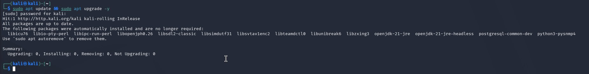
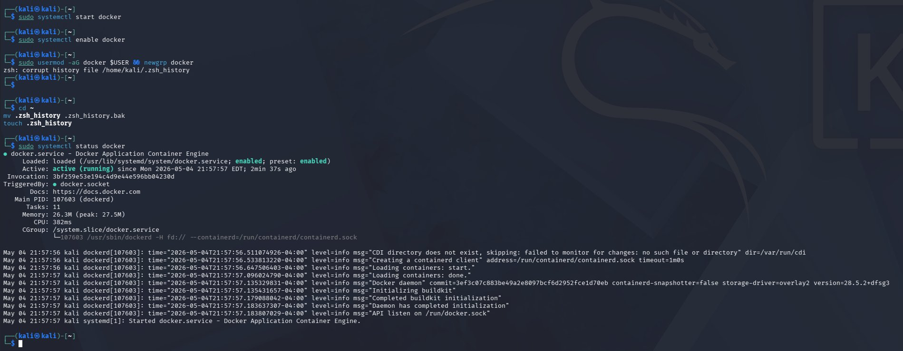
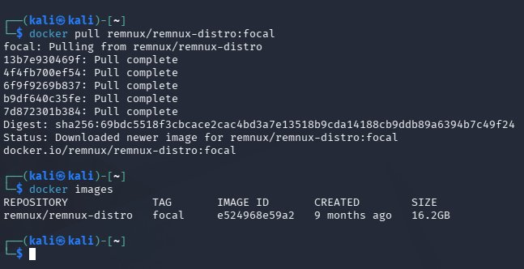
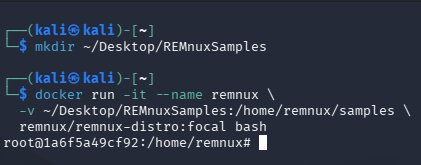
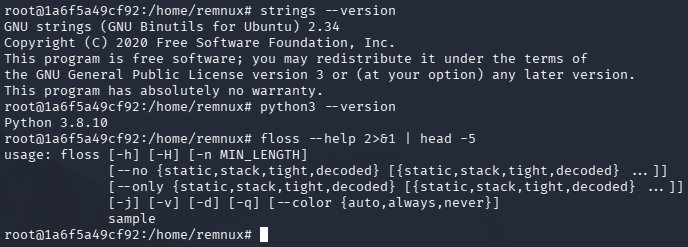
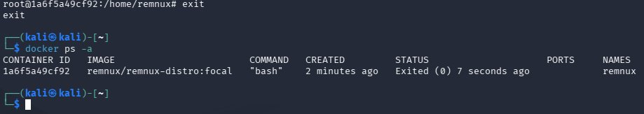
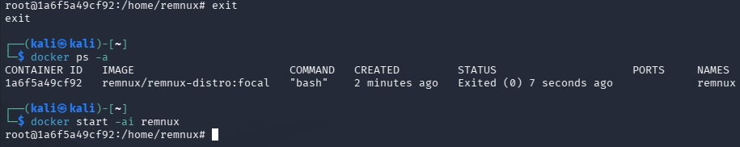
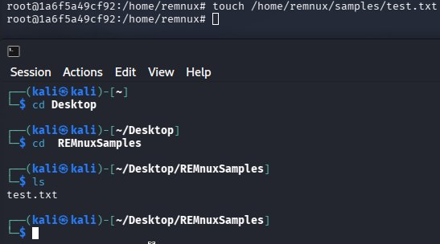

# Offensive/Defensive Hybrid VM — REMnux in Docker on Kali Linux

Today I set up a Docker container inside my Kali Linux VM running REMnux, creating a single environment with both offensive (Kali) and defensive/malware analysis (REMnux) tooling.

---

## Objective

Deploy REMnux as an isolated Docker container inside Kali Linux, with a shared volume for passing malware samples between environments — combining red team and blue team tooling without running two separate VMs.

---

## Tools Used

- **Kali Linux** — Penetration testing host OS
- **Docker** — Container runtime
- **REMnux** (remnux/remnux-distro:focal) — Linux malware analysis distro
- **Docker Volume Mount** — Shared folder between Kali host and REMnux container

---

## Steps

### 1. Update Kali

Ensures the system has the latest packages before installing anything new. Prevents dependency issues down the line.

```bash
sudo apt update && sudo apt upgrade -y
```



---

### 2. Install and Start Docker

Installs Docker, starts the service, enables it on boot, and adds the current user to the Docker group so sudo isn't required for every command.

```bash
sudo apt install -y docker.io
sudo systemctl start docker
sudo systemctl enable docker
sudo usermod -aG docker $USER && newgrp docker
sudo systemctl status docker
```



---

### 3. Pull the REMnux Image

Downloads the REMnux image from Docker Hub. Docker builds the container from it. The `docker images` command confirms it downloaded successfully.

```bash
docker pull remnux/remnux-distro:focal
docker images
```



---

### 4. Create Shared Sample Folder and Launch Container

Creates a folder on the Kali desktop that acts as a bridge between Kali and REMnux. The `-v` flag links that folder to a path inside the container. Anything placed there on Kali is instantly accessible inside REMnux and vice versa.

```bash
mkdir ~/Desktop/REMnuxSamples

docker run -it --name remnux \
  -v ~/Desktop/REMnuxSamples:/home/remnux/samples \
  remnux/remnux-distro:focal bash
```



---

### 5. Verify REMnux Tools

Confirms key analysis tools are present. `strings` extracts readable text from binaries, `floss` finds hidden/obfuscated strings malware authors try to conceal, and `python3` confirms the scripting environment is available.

```bash
strings --version
python3 --version
floss --help 2>&1 | head -5
```



---

### 6. Exit and Manage the Container

Exits the container and confirms it still exists in a stopped state. The container is not deleted — it can be restarted at any time.

```bash
exit
docker ps -a
```



---

### 7. Restart the Container

Restarts the stopped container and reattaches to it. This is the command used to re-enter REMnux in every future session.

```bash
docker start -ai remnux
```



---

### 8. Confirm Shared Volume

Creates a test file inside the container and verifies it appears in the REMnuxSamples folder on Kali, confirming the shared volume is working correctly.

```bash
touch /home/remnux/samples/test.txt
```

```bash
ls ~/Desktop/REMnuxSamples
```



---

## Troubleshooting

**Corrupted ZSH History**

While adding the user to the Docker group, the following error appeared:
`zsh: corrupt history file /home/kali/.zsh_history`

This is unrelated to Docker — the history file simply became corrupted. Fixed with:

```bash
mv .zsh_history .zsh_history.bak
touch .zsh_history
```

Docker was unaffected and continued running normally.

---

## Workflow

1. Drop a sample into `~/Desktop/REMnuxSamples/` on Kali
2. `docker start -ai remnux`
3. `cd /home/remnux/samples` — file is available
4. Run static analysis tools against it
5. Output files are accessible back in `~/Desktop/REMnuxSamples` on Kali

---

## Conclusion

Deployed REMnux inside a Docker container on Kali Linux with a shared volume for sample analysis. The setup gives a single VM the capability to perform both offensive security operations and blue team malware analysis without the need of running two full virtual machines.
